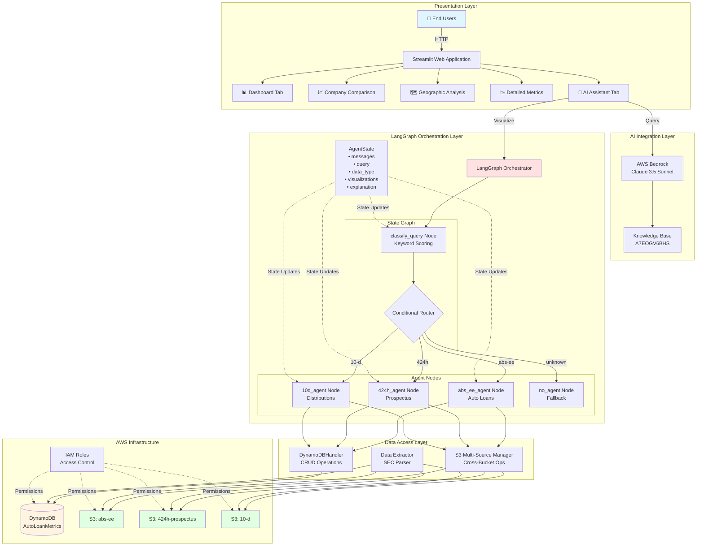
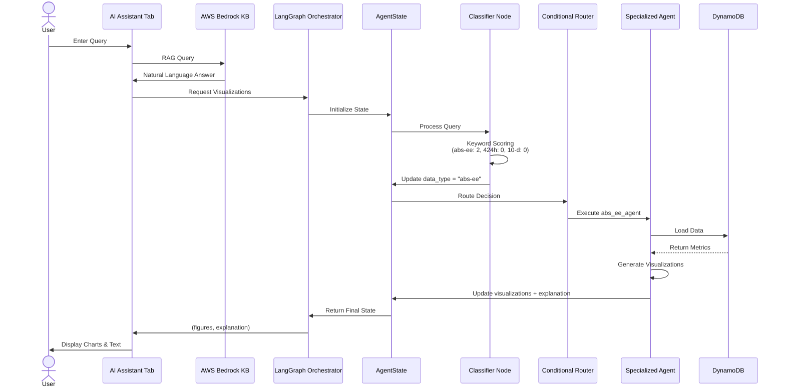
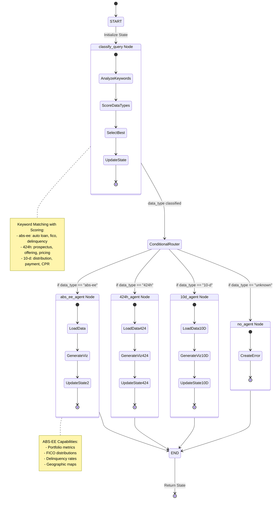
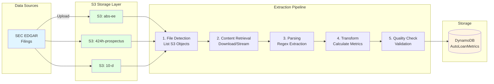
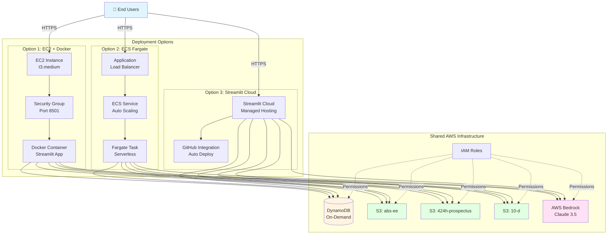
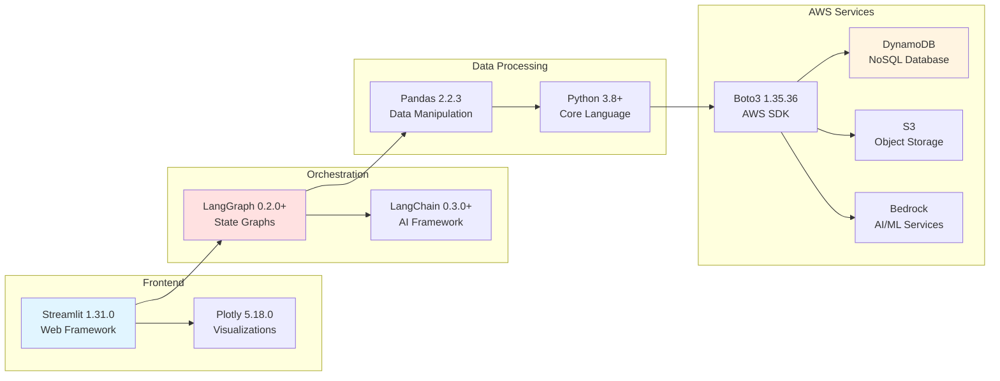

# Architecture Flow Diagrams

## 1. Complete System Architecture



## 2. Query Processing Flow



## 3. LangGraph State Machine



## 4. Data Ingestion Pipeline



## 5. Agent Architecture

```mermaid
graph TB
    Orchestrator[LangGraph Orchestrator<br/>Query Router]
    
    subgraph "VisualizationAgent (ABS-EE)"
        ABSCore[Agent Core<br/>Query Analysis]
        
        subgraph "Visualization Capabilities"
            Portfolio[Portfolio Overview<br/>Total Balance, Loans]
            FICO[FICO Distribution<br/>Credit Quality]
            Delinq[Delinquency Analysis<br/>30+, 60+, 90+ DPD]
            Geo[Geographic Maps<br/>State-level Heatmap]
            Vehicle[Vehicle Mix<br/>New vs Used]
            Compare[Company Comparison<br/>Multi-issuer]
            LoanTerm[Loan Term Analysis<br/>Duration Distribution]
            Interest[Interest Rate Trends<br/>Pricing Analysis]
        end
        
        ABSData[(ABS-EE Data<br/>DynamoDB)]
    end
    
    subgraph "Form424HAgent"
        F424Core[Agent Core<br/>Query Analysis]
        
        subgraph "424H Capabilities"
            Offering[Offering Details<br/>Size, Type, Timing]
            Pricing[Pricing Analysis<br/>Spreads, Yields]
            Structure[Security Structure<br/>Tranches, Classes]
            Ratings[Credit Ratings<br/>Agency Comparison]
            Timeline[Timeline<br/>Key Dates]
            Comp424[Multi-Offering<br/>Comparison]
        end
        
        F424Data[(424H Data<br/>DynamoDB)]
    end
    
    subgraph "Form10DAgent"
        F10DCore[Agent Core<br/>Query Analysis]
        
        subgraph "10-D Capabilities"
            Dist[Distribution Payments<br/>Cash Flow]
            Perf[Pool Performance<br/>KPI Metrics]
            Prepay[Prepayment Speed<br/>CPR, SMM]
            Loss[Loss Severity<br/>Charge-offs]
            Balance[Pool Balance<br/>Outstanding Principal]
            Triggers[Trigger Events<br/>Covenant Breaches]
        end
        
        F10DData[(10-D Data<br/>DynamoDB)]
    end
    
    Orchestrator --> ABSCore
    Orchestrator --> F424Core
    Orchestrator --> F10DCore
    
    ABSCore --> Portfolio
    ABSCore --> FICO
    ABSCore --> Delinq
    ABSCore --> Geo
    ABSCore --> Vehicle
    ABSCore --> Compare
    ABSCore --> LoanTerm
    ABSCore --> Interest
    
    F424Core --> Offering
    F424Core --> Pricing
    F424Core --> Structure
    F424Core --> Ratings
    F424Core --> Timeline
    F424Core --> Comp424
    
    F10DCore --> Dist
    F10DCore --> Perf
    F10DCore --> Prepay
    F10DCore --> Loss
    F10DCore --> Balance
    F10DCore --> Triggers
    
    ABSCore -.-> ABSData
    F424Core -.-> F424Data
    F10DCore -.-> F10DData
    
    style Orchestrator fill:#ffe1e1
    style ABSData fill:#fff4e1
    style F424Data fill:#fff4e1
    style F10DData fill:#fff4e1
```



## 6. Deployment Architecture



## 7. Technology Stack



---

## How to View These Diagrams

### In GitHub
These Mermaid diagrams render automatically in GitHub markdown files.

### In VS Code
Install the "Markdown Preview Mermaid Support" extension:
```
code --install-extension bierner.markdown-mermaid
```

### Export as Images
Use Mermaid Live Editor: https://mermaid.live/
1. Copy diagram code
2. Paste into editor
3. Export as PNG/SVG

### In Documentation Sites
Most documentation platforms (GitBook, MkDocs, Docusaurus) support Mermaid natively.
