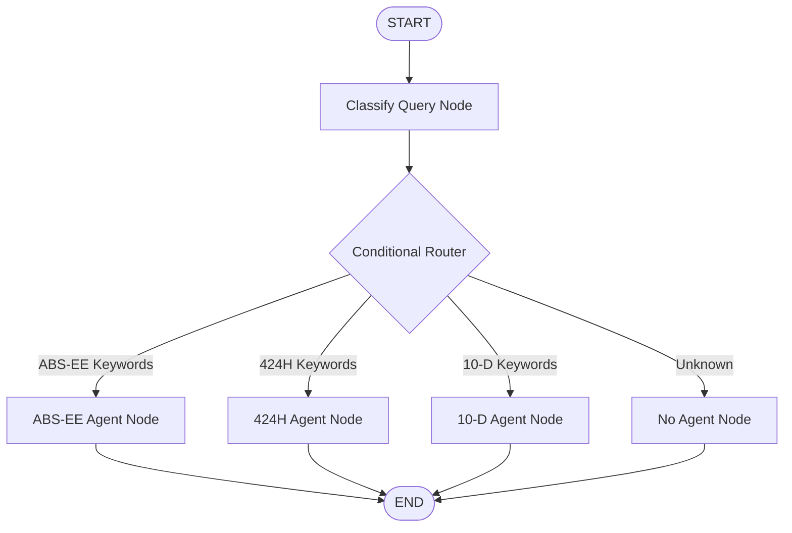

# LangGraph Orchestration Architecture

## Overview
The application now uses **LangGraph** for stateful, graph-based orchestration of multiple specialized agents. This provides better observability, state management, and control flow compared to the simple orchestrator pattern.

## Why LangGraph?

### Benefits
1. **Stateful Execution**: Maintains conversation history and context across nodes
2. **Visual Graph Structure**: Clear representation of agent flow and routing logic
3. **Debugging & Observability**: Track execution through graph nodes
4. **Flexible Routing**: Conditional edges allow dynamic agent selection
5. **Extensibility**: Easy to add new nodes, edges, and agents
6. **LangChain Integration**: Compatible with LangChain ecosystem

## Graph Architecture



## Components

### 1. State Object (`AgentState`)
Tracks information throughout graph execution:
```python
class AgentState(TypedDict):
    messages: Sequence[BaseMessage]      # Conversation history
    query: str                           # User query
    data_type: str                       # Detected data type
    visualizations: List[go.Figure]      # Generated charts
    explanation: str                     # Result explanation
    data_sources: Dict[str, Any]         # Available data
    next_action: str                     # Next step indicator
```

### 2. Graph Nodes

#### **classify_query Node**
- **Purpose**: Analyze query and determine data type
- **Input**: User query from state
- **Process**: Keyword matching with scoring algorithm
- **Output**: Updated state with `data_type` field
- **Next**: Routes to conditional router

#### **Router (Conditional Edge)**
- **Purpose**: Route to appropriate agent based on data type
- **Logic**: 
  - `data_type == 'abs-ee'` → `abs_ee_agent`
  - `data_type == '424h'` → `424h_agent`
  - `data_type == '10-d'` → `10d_agent`
  - Otherwise → `no_agent`

#### **abs_ee_agent Node**
- **Purpose**: Execute ABS-EE visualization agent
- **Input**: Query from state
- **Process**: Generate auto loan visualizations
- **Output**: Visualizations and explanation in state
- **Next**: END

#### **424h_agent Node**
- **Purpose**: Execute Form 424H agent
- **Input**: Query from state
- **Process**: Generate prospectus visualizations
- **Output**: Visualizations and explanation in state
- **Next**: END

#### **10d_agent Node**
- **Purpose**: Execute Form 10-D agent
- **Input**: Query from state
- **Process**: Generate distribution report visualizations
- **Output**: Visualizations and explanation in state
- **Next**: END

#### **no_agent Node**
- **Purpose**: Handle unknown/unavailable data types
- **Input**: Data type from state
- **Process**: Generate helpful error message
- **Output**: Empty visualizations with explanation
- **Next**: END

## State Flow Example

### Example 1: ABS-EE Query
```
Query: "Show me auto loan delinquencies"

1. START
   state = {query: "Show me auto loan delinquencies", ...}

2. classify_query Node
   - Detects keywords: "auto loan", "delinquencies"
   - Sets state.data_type = "abs-ee"
   - Adds AIMessage to state.messages

3. Router
   - Evaluates: state.data_type == "abs-ee" → True
   - Routes to: abs_ee_agent

4. abs_ee_agent Node
   - Calls VisualizationAgent.generate_visualizations()
   - Sets state.visualizations = [fig1, fig2]
   - Sets state.explanation = "Generated 2 visualizations..."
   - Adds AIMessage to state.messages

5. END
   - Returns final state with visualizations
```

### Example 2: Multi-keyword Query
```
Query: "Compare 424h offerings and 10-d distributions"

1. classify_query Node
   - Detects: "424h" (score: 1), "10-d" (score: 1)
   - Selects highest score (or first match)
   - Sets state.data_type = "424h"

2. Router → 424h_agent Node
   - Generates 424H visualizations

3. END
```

## Implementation

### LangGraphOrchestrator Class
**Location**: `src/langgraph_orchestrator.py`

```python
orchestrator = LangGraphOrchestrator(data_sources)
visualizations, explanation = orchestrator.generate_visualizations(query)
```

### Key Methods

#### `_build_graph()`
Constructs the state graph with nodes and edges:
```python
workflow = StateGraph(AgentState)
workflow.add_node("classify_query", self._classify_query)
workflow.add_node("abs_ee_agent", self._abs_ee_agent_node)
# ... more nodes
workflow.add_conditional_edges("classify_query", self._route_to_agent, {...})
workflow.add_edge("abs_ee_agent", END)
return workflow.compile()
```

#### `_classify_query()`
Keyword-based classification with scoring:
```python
def _classify_query(self, state: AgentState) -> AgentState:
    query = state['query'].lower()
    keywords = {
        'abs-ee': ['auto loan', 'fico', 'delinquency', ...],
        '424h': ['prospectus', 'offering', 'pricing', ...],
        '10-d': ['distribution', 'payment', 'cpr', ...]
    }
    # Score each data type
    scores = {dt: sum(1 for kw in kws if kw in query) 
              for dt, kws in keywords.items()}
    data_type = max(scores, key=scores.get)
    state['data_type'] = data_type
    return state
```

#### `_route_to_agent()`
Conditional router function:
```python
def _route_to_agent(self, state: AgentState) -> str:
    data_type = state['data_type']
    if data_type == 'abs-ee' and 'abs-ee' in self.agents:
        return 'abs_ee_agent'
    elif data_type == '424h' and '424h' in self.agents:
        return '424h_agent'
    # ... etc
```

### Integration with Streamlit (app.py)

```python
from langgraph_orchestrator import LangGraphOrchestrator

# In AI Assistant tab
data_sources = load_multi_source_data()
orchestrator = LangGraphOrchestrator(data_sources)
visualizations, explanation = orchestrator.generate_visualizations(question)

for fig in visualizations:
    st.plotly_chart(fig)
```

## Advantages Over Simple Orchestrator

| Feature | Simple Orchestrator | LangGraph Orchestrator |
|---------|-------------------|----------------------|
| **State Management** | Manual | Automatic via StateGraph |
| **Conversation History** | Not tracked | Full message history |
| **Debugging** | Print statements | Graph execution trace |
| **Visualization** | Code comments | Mermaid diagrams |
| **Extensibility** | Manual routing | Add nodes/edges |
| **Observability** | Limited | Full execution path |
| **Error Handling** | Basic try-catch | Node-level handling |
| **Testing** | Hard to test flow | Test individual nodes |

## Advanced Features

### 1. Conversation History
```python
# Get full execution trace
history = orchestrator.get_conversation_history(query)
for msg in history:
    print(f"{msg['role']}: {msg['content']}")
```

### 2. Graph Visualization
```python
# Get Mermaid diagram
diagram = orchestrator.visualize_graph()
print(diagram)
```

### 3. State Inspection
```python
# Access final state
initial_state = {...}
final_state = orchestrator.graph.invoke(initial_state)
print(final_state['messages'])
print(final_state['data_type'])
```

## Extending the Graph

### Adding a New Agent Node

1. **Create Agent Class** (`src/new_agent.py`)
2. **Update LangGraphOrchestrator**:

```python
# In _initialize_agents()
if 'new-type' in self.data_sources:
    agents['new-type'] = NewAgent(...)

# In _build_graph()
workflow.add_node("new_agent", self._new_agent_node)

# Add to router
def _route_to_agent(self, state):
    if state['data_type'] == 'new-type':
        return 'new_agent'

# Update conditional edges
workflow.add_conditional_edges(
    "classify_query",
    self._route_to_agent,
    {
        "new_agent": "new_agent",
        # ... existing routes
    }
)

workflow.add_edge("new_agent", END)
```

3. **Add Keywords to Classifier**:
```python
# In _classify_query()
keywords['new-type'] = ['keyword1', 'keyword2', ...]
```

### Adding Pre/Post Processing Nodes

```python
# Add preprocessing node
workflow.add_node("preprocess", self._preprocess_query)
workflow.set_entry_point("preprocess")
workflow.add_edge("preprocess", "classify_query")

# Add postprocessing node
workflow.add_node("postprocess", self._postprocess_results)
workflow.add_edge("abs_ee_agent", "postprocess")
workflow.add_edge("postprocess", END)
```

## Monitoring & Debugging

### Enable Debug Mode
```python
# Set environment variable
import os
os.environ["LANGCHAIN_TRACING_V2"] = "true"
os.environ["LANGCHAIN_API_KEY"] = "your-key"  # Optional: for LangSmith
```

### Custom Logging
```python
def _classify_query(self, state: AgentState) -> AgentState:
    print(f"[classify_query] Input: {state['query']}")
    # ... classification logic
    print(f"[classify_query] Output: {state['data_type']}")
    return state
```

## Performance Considerations

1. **Agent Initialization**: Agents initialized once during orchestrator creation
2. **State Size**: Keep state minimal for faster execution
3. **Caching**: Use `@st.cache_data` in Streamlit for data_sources
4. **Parallel Execution**: LangGraph supports parallel node execution (future enhancement)

## Future Enhancements

### 1. Parallel Agent Execution
Execute multiple agents simultaneously for comprehensive analysis:
```python
workflow.add_conditional_edges(
    "classify_query",
    lambda s: ["abs_ee_agent", "424h_agent"],  # Return multiple nodes
    {
        "abs_ee_agent": "abs_ee_agent",
        "424h_agent": "424h_agent"
    }
)
```

### 2. Feedback Loop
Add user feedback to improve routing:
```python
workflow.add_node("collect_feedback", self._collect_feedback)
workflow.add_edge("END", "collect_feedback")
```

### 3. LLM-based Classification
Replace keyword matching with LLM:
```python
from langchain_openai import ChatOpenAI

def _classify_query(self, state):
    llm = ChatOpenAI()
    prompt = f"Classify this query: {state['query']}"
    response = llm.invoke(prompt)
    state['data_type'] = extract_type(response)
    return state
```

### 4. Multi-turn Conversations
Support follow-up questions:
```python
workflow.add_conditional_edges(
    "END",
    lambda s: "classify_query" if s['has_followup'] else END
)
```

## Troubleshooting

### Issue: Graph execution hangs
- Check for cycles in graph
- Ensure all nodes return to END
- Verify conditional edges have all cases covered

### Issue: Agent not routing correctly
- Add debug prints in `_route_to_agent()`
- Check keyword lists in `_classify_query()`
- Verify agent initialization

### Issue: State not updating
- Ensure node functions return modified state
- Check TypedDict annotations match
- Verify no immutable state modifications

## References

- [LangGraph Documentation](https://langchain-ai.github.io/langgraph/)
- [StateGraph API](https://langchain-ai.github.io/langgraph/reference/graphs/)
- [LangChain Core](https://python.langchain.com/docs/langchain_core/)
